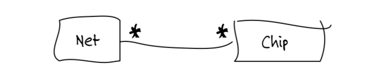
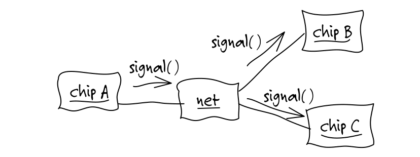
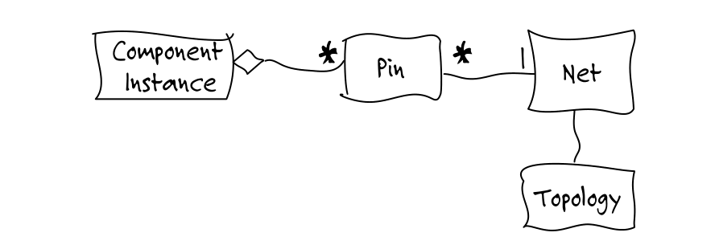
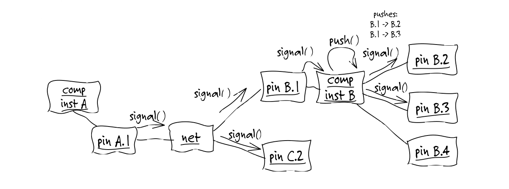
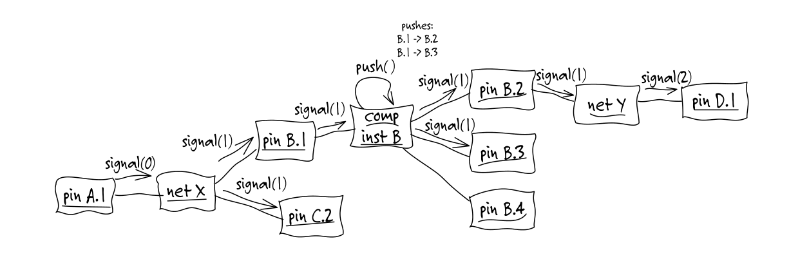
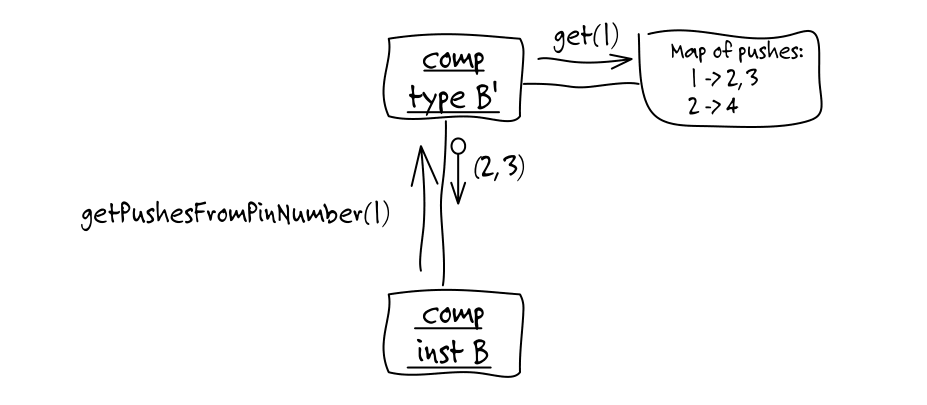
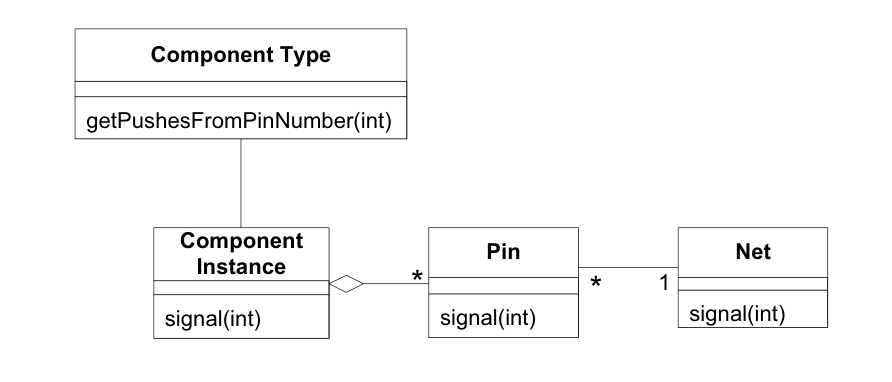

---
➡ [قبلی](../Part-1-Preface.md) | [فصل ۱: واکاوی دانش - مقدمه](./C01-00.md) | [بعدی](./C01-01.md) ⬅
---

# فصل ۱: واکاوی دانش - مقدمه

چند سال پیش، شروع به طراحی یک ابزار نرم‌افزاری تخصصی برای طراحی `PCB` (بردهای مدار چاپی) کردم. یک مشکل وجود داشت: من هیچ چیز در مورد سخت‌افزار الکترونیکی نمی‌دانستم. البته به چند طراح `PCB` دسترسی داشتم، اما آن‌ها معمولاً ظرف سه دقیقه حسابی گیجم می‌کردند. چطور قرار بود به اندازه کافی بفهمم تا بتوانم این نرم‌افزار را بنویسم؟ قطعاً که قرار نبود قبل از موعد تحویل، یک مهندس برق بشوم!

ما سعی کردیم از طراحان `PCB` بخواهیم دقیقاً به من بگویند نرم‌افزار چه باید بکند. ایده بدی بود. آن‌ها طراحان مدار فوق‌العاده‌ای بودند، اما ایده‌های نرم‌افزاری‌شان معمولاً شامل خواندن یک فایل `ASCII`، مرتب‌سازی آن، نوشتن دوباره‌اش با کمی حاشیه‌نویسی، و تولید یک گزارش می‌شد. این رویکرد به وضوح نمی‌توانست آن جهش بلندی در بهره‌وری که آن‌ها به دنبالش بودند را محقق کند.

چند جلسه اول دلسردکننده بودند، اما روزنه امیدی در گزارش‌هایی که درخواست می‌کردند وجود داشت. این گزارش‌ها همواره شامل «نت‌ها» و جزئیات مختلف درباره آن‌ها می‌شدند. یک نت، در این دامنه، اساساً یک هادی سیم است که می‌تواند هر تعداد قطعه را روی یک `PCB` به هم متصل کرده و یک سیگنال الکتریکی را به هر چیزی که به آن وصل است منتقل کند. ما نخستین عنصر مدل دامنه را یافته بودیم.

*شکل 1.1*

شروع کردم به کشیدن نمودارهایی برایشان، در حالی که درباره کارهایی که می‌خواستند نرم‌افزار انجام دهد صحبت می‌کردیم. من از گونه‌ای غیررسمی از `Object Interaction Diagrams` (نمودارهای تعامل اشیاء) برای پیش بردن گام‌به‌گام سناریوها استفاده می‌کردم.

*شکل 1.2*

**متخصص PCB اول:** قطعات  که لازم نیست حتماً تراشه باشند.

**توسعه‌دهنده (من):** پس باید فقط «قطعات » صدایشان کنم؟

**متخصص اول:** ما به آن‌ها `Component Instances` (نمونه‌های قطعات) می‌گوییم. ممکن است تعداد زیادی از یک قطعه یکسان وجود داشته باشد.

**متخصص دوم:** مستطیل «نت» دقیقاً شبیه یک نمونه قطعه به نظر می‌رسد.

**متخصص اول:** او از شیوه نشانه‌گذاری ما استفاده نمی‌کند. حدس می‌زنم برای آن‌ها همه چیز یک مستطیل است.

**توسعه‌دهنده:** متأسفانه باید بگویم، بله. حدس می‌زنم بهتر است این شیوه نشانه‌گذاری را کمی بیشتر توضیح دهم.

آن‌ها مدام من را تصحیح می‌کردند و همان‌طور که این کار را می‌کردند، من شروع به یادگیری کردم. ما برخوردها و ابهامات را در اصطلاحات‌شان و نیز اختلاف‌های فنی میان دیدگاه‌هایشان را رفع کردیم، و آن‌ها نیز آموختند. شروع کردند به توضیح دقیق‌تر و سازگارتر چیزها، و ما با هم شروع به توسعه یک مدل کردیم.

**متخصص اول:** کافی نیست بگوییم یک سیگنال به یک `Ref-des` می‌رسد، باید پایه را هم بدانیم.

**توسعه‌دهنده:** `Ref-des`؟

**متخصص دوم:** همان نمونه قطعه است. `Ref-des` چیزی است که در یک ابزار خاص که استفاده می‌کنیم به آن گفته می‌شود.

**متخصص اول:** به هر حال، یک نت، یک پایه مشخص از یک نمونه را به یک پایه مشخص از نمونه دیگر متصل می‌کند.

**توسعه‌دهنده:** آیا می‌گویید که یک پایه فقط به یک نمونه قطعه تعلق دارد و فقط به یک نت متصل می‌شود؟

**متخصص اول:** بله، درست است.

**متخصص دوم:** همچنین، هر نت یک توپولوژی دارد، یک آرایش که نحوه اتصال عناصر نت را تعیین می‌کند.

**توسعه‌دهنده:** بسیار خب، نظرتان در این باره چیست؟

*شکل 1.3*

برای متمرکز ساختن کاوش‌مان، مدتی خود را به مطالعه یک ویژگی خاص محدود کردیم. یک «شبیه‌سازی پروب» می‌بایست انتشار یک سیگنال را برای یافتن محل‌های احتمالی انواع خاصی از مشکلات در طراحی، ردیابی می‌کرد.

**توسعه‌دهنده:** می‌فهمم که چطور سیگنال توسط نت به تمام پایه‌های متصل منتقل می‌شود، اما چطور از آن فراتر می‌رود؟ آیا توپولوژی ربطی به این قضیه دارد؟

**متخصص دوم:** نه. قطعه سیگنال را به جلو هُل می‌دهد.

**توسعه‌دهنده:** ما قطعاً نمی‌توانیم رفتار داخلی یک تراشه را مدل کنیم. این کار خیلی پیچیده است.

**متخصص دوم:** لازم نیست. می‌توانیم از یک ساده‌سازی استفاده کنیم. فقط یک فهرست از هُل دادن‌ها از درون کامپوننت، از پایه‌های مشخصی به پایه‌های مشخص دیگر.

**توسعه‌دهنده:** چیزی شبیه این؟

*شکل 1.4*

**توسعه‌دهنده:** اما دقیقاً چه چیزی نیاز دارید از این محاسبه بدانید؟

**متخصص دوم:** ما به دنبال تأخیرهای طولانی سیگنال می‌گردیم — مثلاً، هر مسیر سیگنالی که بیش از دو یا سه پرش طول داشته باشد. این یک قاعده سرانگشتی است. اگر مسیر خیلی طولانی باشد، ممکن است سیگنال در طول چرخه ساعت نرسد.

**توسعه‌دهنده:** بیش از سه پرش... پس باید طول مسیرها را محاسبه کنیم. و یک پرش چیست؟

**متخصص دوم:** هر بار که سیگنال از روی یک نت عبور کند، یک پرش محسوب می‌شود.

**توسعه‌دهنده:** پس می‌توانیم تعداد پرش‌ها را به جلو منتقل کنیم، و نت می‌تواند آن را یکی اضافه کند، مثل این.

*شکل 1.5*

**توسعه‌دهنده:** تنها بخشی که برایم روشن نیست این است که این «هل دادن‌ها» از کجا می‌آیند. آیا ما آن داده را برای هر نمونه قطعه ذخیره می‌کنیم؟

**متخصص دوم:** هل دادن‌ها برای تمام نمونه‌های یک کامپوننت یکسان خواهند بود.

**توسعه‌دهنده:** پس نوع قطعه است که هل دادن‌ها را تعیین می‌کند. برای هر نمونه‌ای یکسان خواهند بود؟

*شکل 1.6*

**متخصص دوم:** دقیقاً مطمئن نیستم بعضی از این‌ها چه معنایی دارند، اما تصور می‌کنم ذخیره‌سازی مسیرهای عبور برای هر کامپوننت چیزی شبیه آن شود.

**توسعه‌دهنده:** ببخشید، یک کمی زیادی وارد جزئیات شدم. فقط داشتم به آن فکر می‌کردم. خب، حالا توپولوژی کجای قضیه وارد می‌شود؟

**متخصص اول:** آن برای شبیه‌سازی پروب استفاده نمی‌شود.

**توسعه‌دهنده:** پس من فعلاً آن را کنار می‌گذارم، خوب است؟ وقتی به آن قابلیت‌ها رسیدیم می‌توانیم برگردانیم.

و ماجرا به همین منوال پیش رفت (با دست‌انداز‌های بسیار بیشتری نسبت به آنچه اینجا نشان داده شده است). طوفان فکری و پالایش؛ پرسش و توضیح. مدل همراه با درک من از دامنه و درک آن‌ها از چگونگی نقش‌آفرینی مدل در راه‌حل، توسعه یافت. یک نمودار کلاس که بازنمای آن مدل اولیه است، چیزی شبیه این به نظر می‌رسد.

*شکل 1.7*

پس از چند روز پاره‌وقت دیگر که به همین منوال گذشت، احساس کردم به اندازه کافی درک کرده‌ام تا دست به کد زدن بزنم. یک نمونهٔ اولیه بسیار ساده نوشتم که توسط یک چارچوب تست خودکار هدایت می‌شد. از تمام زیرساخت‌ها پرهیز کردم. هیچ `Persistence` و هیچ رابط کاربری در کار نبود. این کار به من اجازه داد تا بر رفتار تمرکز کنم. تنها در عرض چند روز دیگر توانستم یک شبیه‌سازی پروب ساده را به نمایش بگذارم. اگرچه از داده‌های ساختگی استفاده می‌کرد و متن خام را در کنسول می‌نوشت، با این وجود محاسبات واقعی طول مسیرها را با استفاده از اشیاء جاوا انجام می‌داد. آن اشیاء جاوا بازتاب‌دهنده مدلی بودند که میان متخصصان دامنه و من به اشتراک گذاشته شده بود.

ملموس بودن این نمونه اولیه برای متخصصان دامنه روشن‌تر ساخت که مدل چه معنایی دارد و چگونه با نرم‌افزار در حال کار مرتبط می‌شود. از آن نقطه به بعد، مباحث مدل‌سازی ما تعاملی‌تر شد، چرا که آن‌ها می‌توانستند ببینند من چگونه دانش تازه‌کسب‌شده‌ام را در مدل و سپس در نرم‌افزار جا می‌دهم. و آن‌ها نیز بازخوردی ملموس از نمونه اولیه برای ارزیابی افکار خودشان در اختیار داشتند.

درون آن مدل که طبیعتاً بسیار پیچیده‌تر از آنچه اینجا نشان داده شد از کار درآمد، دانشی درباره دامنهٔ `PCB` نهفته بود که به مسائلی که حل می‌کردیم مربوط می‌شد. این مدل بسیاری از مترادف‌ها و تفاوت‌های جزئی در توصیفات را یکپارچه کرد. صدها واقعیت را که مهندسان می‌فهمیدند اما مستقیماً مرتبط نبودند مانند ویژگی‌های دیجیتالی واقعی کامپوننت‌ها، حذف کرد. یک متخصص نرم‌افزار مثل من می‌توانست به نمودارها نگاه کند و در عرض چند دقیقه شروع به درک موضوع نرم‌افزار کند. او چارچوبی برای سازمان‌دهی اطلاعات جدید و یادگیری سریع‌تر، حدس زدن بهتر در مورد آنچه مهم است و آنچه نیست، و برقراری ارتباط بهتر با مهندسان `PCB` در اختیار داشت.

درون آن مدل که طبیعتاً بسیار پیچیده‌تر از آنچه اینجا نشان داده شد از کار درآمد، دانشی درباره دامنهٔ PCB نهفته بود که به مسائلی که حل می‌کردیم مربوط می‌شد. این مدل بسیاری از مترادف‌ها و تفاوت‌های جزئی در توصیفات را یکپارچه کرد. صدها واقعیت را که مهندسان می‌فهمیدند اما مستقیماً مرتبط نبودند مانند ویژگی‌های دیجیتالی واقعی کامپوننت‌ها، حذف کرد. یک متخصص نرم‌افزار مثل من می‌توانست به نمودارها نگاه کند و در عرض چند دقیقه شروع به درک موضوع نرم‌افزار کند. او چارچوبی برای سازمان‌دهی اطلاعات جدید و یادگیری سریع‌تر، حدس زدن بهتر در مورد آنچه مهم است و آنچه نیست، و برقراری ارتباط بهتر با مهندسان PCB در اختیار داشت.

---
➡ [قبلی](../Part-1-Preface.md) | [فصل ۱: واکاوی دانش - مقدمه](./C01-00.md) | [بعدی](./C01-01.md) ⬅
---